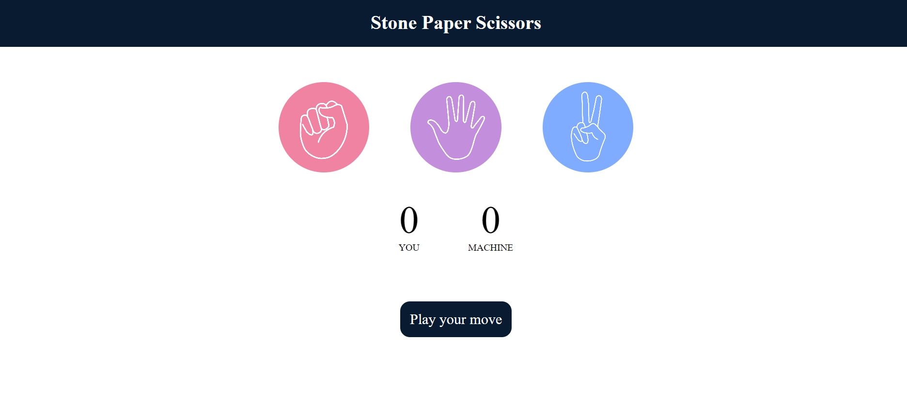
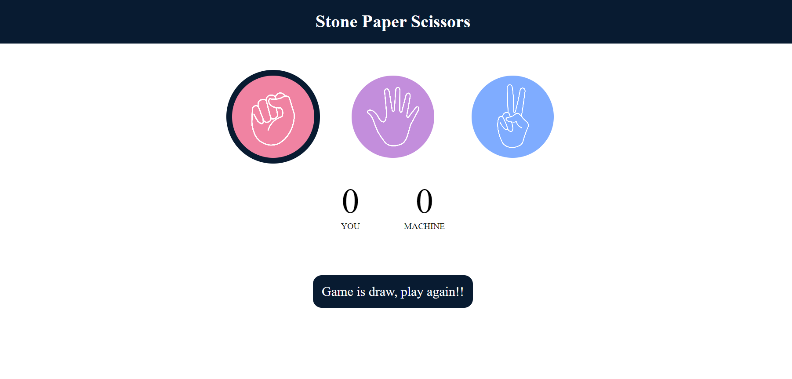
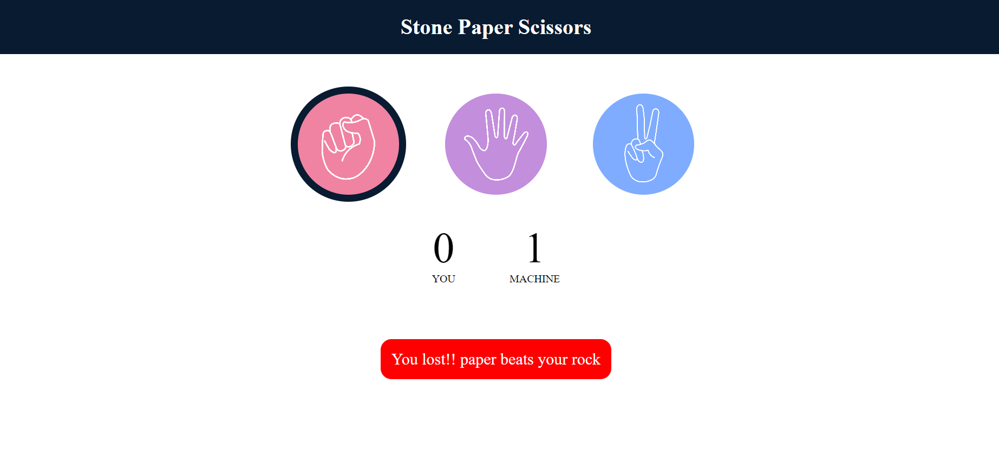
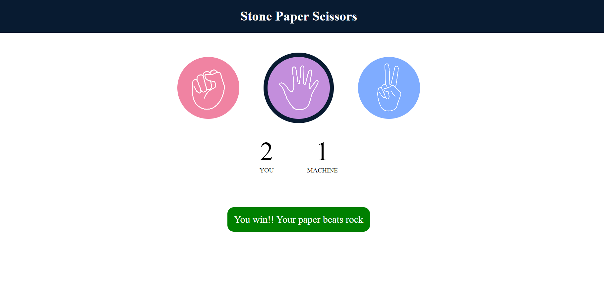

<h2 align ="center">Stone Paper Scissors Game</h2>
<h3>Game Description:</h3>

Rock Paper Scissor is a hand game played between two people, in which each player simultaneously forms one of three shapes:

 - rock is a closed fist
 
 - paper is a flat hand with fingers and thumb extended and the palm facing downward
 
 - scissors is a fist with the index and middle fingers fully extended.

The winner of the game is decided as per the below rules: 

- [x] Rock vs Paper -> Paper wins. 
- [x] Rock vs Scissor -> Rock wins.
- [x] Scissors vs Paper -> Scissors wins

<h2>ScreenShots</h2>

### 1. Start Game

<table>
        <tr> 
        <td></td
        </tr>
</table>

### 2. Game Draw

<table>
        <tr> 
        <td></td
        </tr>
</table>

### 3. Game Lost

<table>
        <tr> 
        <td></td>
        </tr>
</table>

### 4. Game Win

<table>
        <tr> 
        <td></td>
        </tr>
</table>

## Technologies Used:

- [x] **Frontend:** HTML, CSS
- [x] **Backend:** JavaScript 

